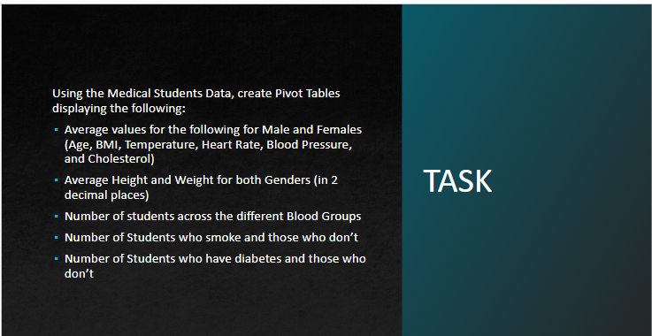
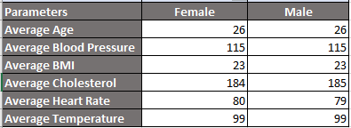
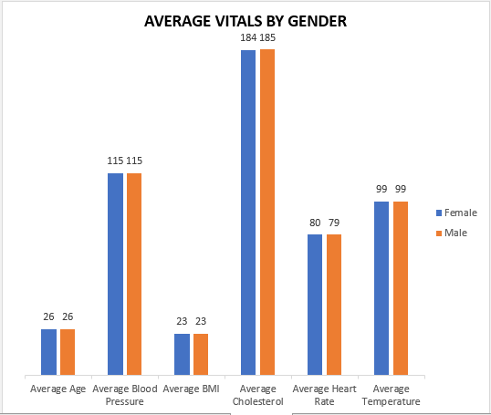
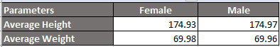
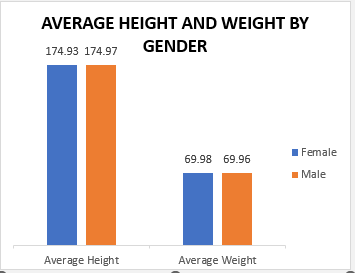
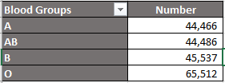
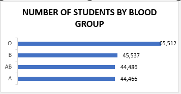
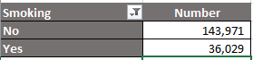
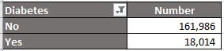
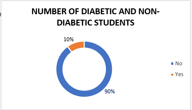

# Medical-students-data

## Introduction

I have been given a dataset that contains some information about the medical students in a school and this time I will be using pivot tables and charts in Microsoft Excel to show my analysis.

## Brief description 
After inserting the pivot table to a new sheet, I dragged the gender field to the column area and dragged the parameters to the values area to get their averages. I also dragged the blood group, diabetes and smoking fields to the rows area and also to values to get a count of each. I then chose appropriate visuals for each table.

## Analysis

     |      

The age, BMI, blood pressure and temperature are averagely the same in both genders. The only two exceptions are cholesterol where the females were averagely a point above the males and heart rate where the males were averagely a point above the females.

     |      

When I compared the average weight and height between both genders, I observed that the males just had a 0.01 point above the females in height and the females had just a 0.01 point above the males in weight.

     |      

I observed that of all 4 blood groups, more students had blood group "O" with a count of 65,512. This information is important for cases where blood is required for transfusion.

     |      

     |      

This table shows that there is a very large portion of the students that do not smoke and those without diabetes compared to the few that do which shows that there are considerably more healthy students than unhealthy in the medical school.
